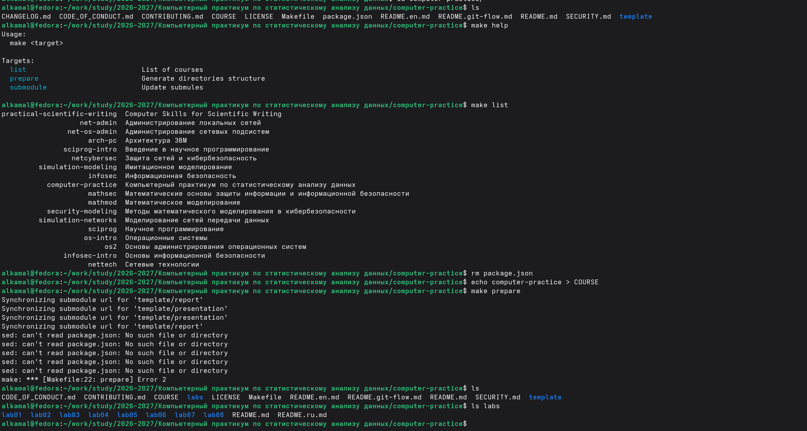
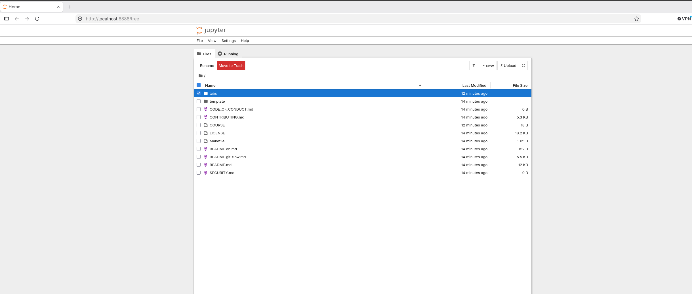
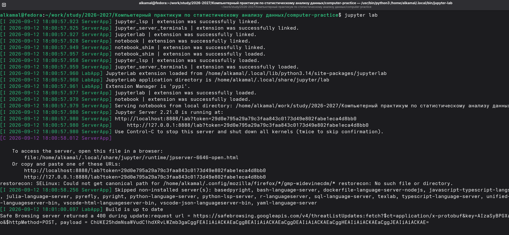
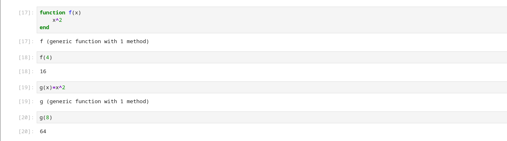
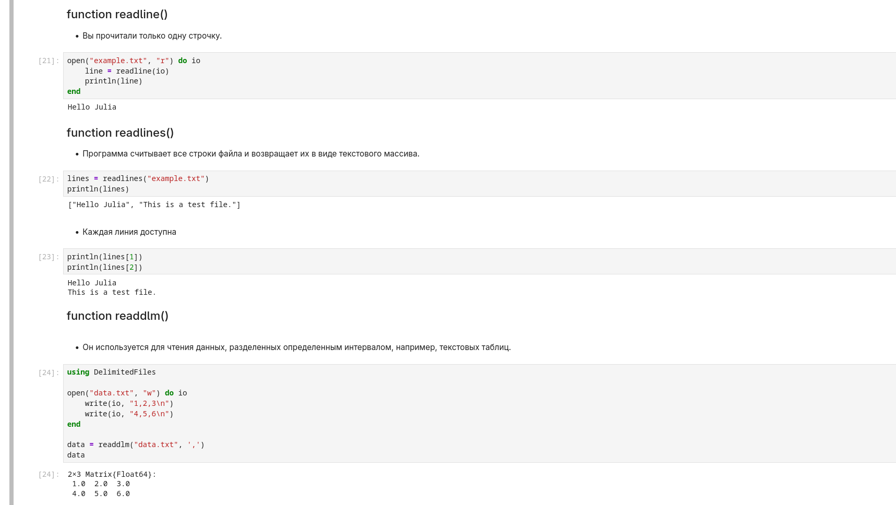

---
## Author
author:
  name: Ибрахим Мохсейн Алькамаль
  degrees: Student (4 курс)
  orcid: ""
  email: 1032225432@rudn.ru
  affiliation:
    - name: Российский университет дружбы народов
      country: Российская Федерация
      postal-code: 117198
      city: Москва
      address: ул. Миклухо-Маклая, д. 6
## Title
title: Лабораторная работа №01
subtitle: "Компьютерный практикум по статистическому анализу данных"
license: CC BY
date: today
date-format: "YYYY-MM-DD" 
---

# Информация

## Докладчик

:::::::::::::: {.columns align=center}
::: {.column width="70%"}

  - Ибрахим Мохсейн Алькамаль
  - Российский университет дружбы народов

:::
::: {.column width="30%"}

:::
::::::::::::::

# Цель работы

-   Освоить основные возможности языка Julia.
-   Изучить работу в интерактивной среде и JupyterLab.
-   Рассмотреть типы данных, ввод и вывод, арифметические и логические
    операции.
-   Освоить создание функций и базовые операции с векторами и матрицами.

# Выполнение лабораторной работы

## Подготовка рабочей директории и репозитория

-   Создана рабочая директория для курса.
-   Клонирован репозиторий `computer-practice` вместе с подмодулями.

{#fig-1 width="70%"}

## Подготовка структуры лабораторных работ

-   Просмотрены доступные цели `make` и учебные курсы.
-   Подготовлена структура курса `computer-practice`.
-   Созданы каталоги `lab01`--`lab08`.

{#fig-2 width="70%"}

## Настройка Git

-   Добавлен удалённый репозиторий `gitverse`.
-   Проверена конфигурация удалённых репозиториев.
-   Изменения зафиксированы сообщением
    `feat(main): make course structure`.

{#fig-3 width="70%"}

## Проверка программного окружения

-   Julia: версия `1.12.1`.
-   JupyterLab: версия `4.6.3`.
-   Проверены версии основных компонентов Jupyter.

{#fig-4 width="70%"}

## Запуск Julia REPL

-   Запущена интерактивная среда Julia REPL.
-   Отображена версия Julia `1.12.1`.
-   Для ввода команд используется приглашение `julia>`.

{#fig-5 width="70%"}

## Установка IJulia

-   Установлен пакет `IJulia`.
-   Автоматически добавлены необходимые зависимости.
-   Выполнена предварительная компиляция.

{#fig-6 width="70%"}

## Запуск Jupyter Notebook

-   Проверен список доступных ядер Jupyter.
-   Доступны ядра `julia-1.12` и `python3`.
-   Запущен локальный сервер Jupyter на порту `8888`.

{#fig-7 width="70%"}

## Интерфейс Jupyter

-   Открыт интерфейс Jupyter в браузере.
-   Отображены каталоги `labs`, `template` и файлы репозитория.

{#fig-8 width="70%"}

## Запуск JupyterLab

-   Выполнена команда `jupyter lab`.
-   Компоненты JupyterLab успешно загружены.
-   Локальный сервер работает на порту `8888`.

{#fig-9 width="70%"}

## Ядро Julia в JupyterLab

-   В Launcher доступны различные среды выполнения.
-   Доступно ядро `Julia 1.12`.
-   Можно создавать Notebook и консоль с Julia.

{#fig-10 width="70%"}

## Создание Notebook

-   Создан новый Notebook.
-   Выбрано ядро `Julia 1.12`.
-   Команды Julia выполняются в ячейках JupyterLab.

{#fig-11 width="70%"}

## Арифметические операции и справка

-   Выполнены простейшие арифметические операции.
-   Получены результаты вычислений.
-   Командой `?println` открыта документация функции `println`.

{#fig-12 width="70%"}

## Системные команды

-   Выполнена команда `;date`.
-   Выполнена команда `;whoami`.
-   Выведены дата, время и имя пользователя системы.

{#fig-13 width="70%"}

## Числовые типы Julia

-   Исследованы типы данных с помощью `typeof`.
-   Рассмотрены целые, вещественные, комплексные и иррациональные
    значения.
-   Проверены `Inf`, `-Inf`, `NaN` и диапазоны целочисленных типов.
-   Выполнены преобразование и продвижение типов.

{#fig-14 width="70%"}

## Создание функций

-   Функция `f(x)` задана конструкцией `function ... end`.
-   Функция `g(x)` задана краткой записью.
-   Для аргументов `4` и `8` получены результаты `16` и `64`.

{#fig-15 width="70%"}

## Массивы и матрицы

-   Рассмотрено создание массивов и матриц.
-   Выполнено обращение к элементам по индексам.
-   Создана матрица размером `2×2`.
-   Выполнено матричное выражение с результатом `27`.

{#fig-16 width="70%"}

# Задания для самостоятельной работы

## Функции ввода и вывода

-   Рассмотрены `print()`, `println()` и `show()`.
-   `write()` использована для записи в `example.txt`.
-   `read()` использована для чтения содержимого файла.

{#fig-17 width="70%"}

## Чтение данных из файлов

-   `readline()` считывает одну строку.
-   `readlines()` возвращает строки файла в виде массива.
-   `readdlm()` считывает числовые данные из `data.txt` в виде матрицы.

{#fig-18 width="70%"}

## Функция parse()

-   `parse()` преобразует строковые значения в заданный тип.
-   `"123"` преобразовано в `Int64`.
-   `"3.1415"` преобразовано в `Float64`.
-   `"1010"` в системе счисления с основанием `2` преобразовано в `10`.

{#fig-19 width="70%"}

## Базовые арифметические операции

-   Заданы переменные разных числовых типов.
-   Выполнены сложение, вычитание и умножение.
-   Выполнено обычное деление.
-   Рассмотрены `div()` и `rem()`.

{#fig-20 width="70%"}

## Степень, сравнение и логические операции

-   Выполнено возведение в степень.
-   Выполнено извлечение квадратного корня.
-   Рассмотрены операции `>`, `<`, `==`, `!=`.
-   Выполнены логические операции `&&`, `||`, `!`.

{#fig-21 width="70%"}

## Операции над векторами

-   Созданы векторы `v1` и `v2`.
-   Выполнены сложение и вычитание.
-   Скалярное произведение вычислено с помощью `dot()`.
-   Выполнены транспонирование и умножение на скаляр.

{#fig-22 width="70%"}

## Операции над матрицами

-   Созданы матрицы `A` и `B` размером `2×2`.
-   Выполнены сложение и вычитание.
-   Выполнено транспонирование матрицы `A`.
-   Матрица `A` умножена на скаляр `2`.

{#fig-23 width="70%"}

# Заключение

-   Настроена среда Julia и JupyterLab.
-   Изучены основные типы данных.
-   Рассмотрены функции чтения, записи и вывода информации.
-   Исследована функция `parse()`.
-   Выполнены арифметические, логические операции и операции сравнения.
-   Рассмотрены способы создания функций.
-   Выполнены основные операции с векторами и матрицами.
