---
## Author
author:
  name: Ибрахим Мохсейн Алькамаль
  degrees: Student (4 курс)
  orcid: ""
  email: 1032225432@rudn.ru
  affiliation:
    - name: Российский университет дружбы народов
      country: Российская Федерация
      postal-code: 117198
      city: Москва
      address: ул. Миклухо-Маклая, д. 6

## Title
title: "Отчёт по лабораторной работе №01"
subtitle: "Компьютерный практикум по статистическому анализу данных"
license: "CC BY"
---

# Цель работы

Освоить основные возможности языка программирования Julia: работу в интерактивной среде и JupyterLab, основные типы данных, функции ввода и вывода, арифметические и логические операции, создание функций, а также базовые операции с векторами и матрицами.

# Выполнение лабораторной работы

В начале работы была создана рабочая директория для курса, после чего в неё был клонирован репозиторий `computer-practice` вместе с используемыми подмодулями ([рис. @fig-1]).

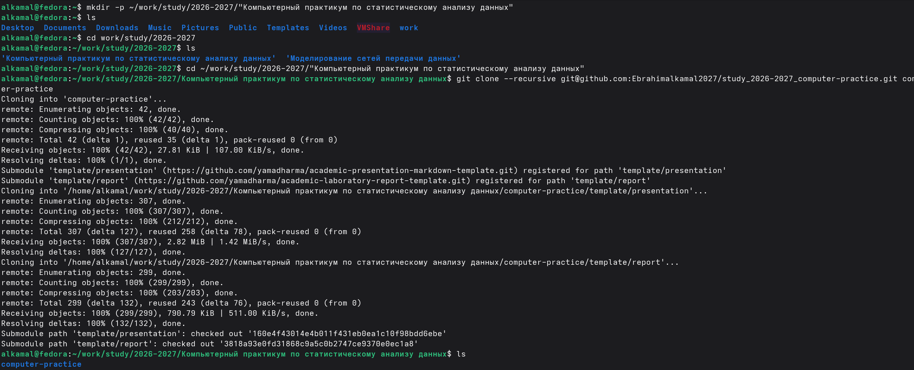{#fig-1 width=70%}

После перехода в каталог репозитория был просмотрен список доступных целей `make` и учебных курсов. Затем была выполнена подготовка структуры каталогов для курса `computer-practice`, в результате чего были созданы директории лабораторных работ `lab01`–`lab08` ([рис. @fig-2]).

{#fig-2 width=70%}

Далее был добавлен удалённый репозиторий `gitverse` и проверена конфигурация удалённых репозиториев. После подготовки структуры проекта выполнена фиксация изменений в Git с сообщением `feat(main): make course structure` ([рис. @fig-3]).

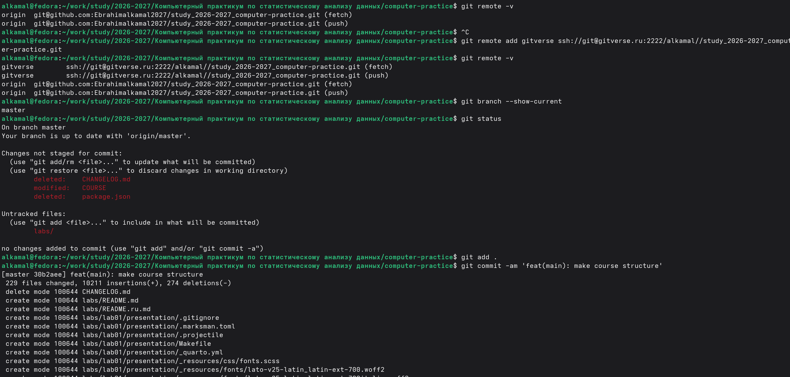{#fig-3 width=70%}

Для проверки программного окружения были выведены версии установленных средств. В системе используется Julia версии `1.12.1`, а также JupyterLab версии `4.6.3`; дополнительно показаны версии основных компонентов Jupyter ([рис. @fig-4]).

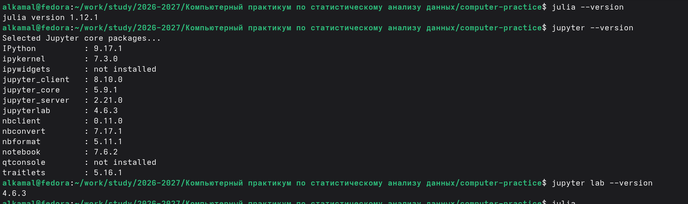{#fig-4 width=70%}

Для начала работы с языком Julia был выполнен запуск интерактивной среды REPL. После запуска отображается информация об установленной версии Julia `1.12.1` и появляется приглашение `julia>` для ввода команд ([рис. @fig-5]).

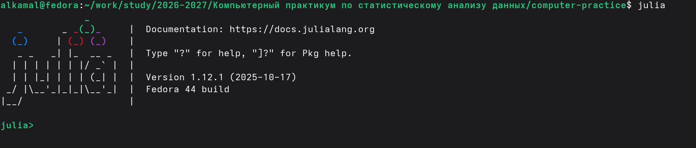{#fig-5 width=70%}

Для интеграции Julia с Jupyter был установлен пакет `IJulia` через менеджер пакетов Julia. В процессе установки были автоматически добавлены необходимые зависимости и выполнена их предварительная компиляция ([рис. @fig-6]).

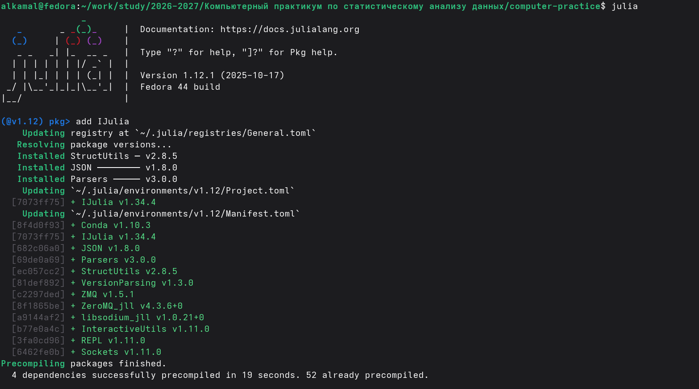{#fig-6 width=70%}

После установки `IJulia` был проверен список доступных ядер Jupyter, в котором присутствуют `julia-1.12` и `python3`. Затем командой `jupyter notebook` был запущен локальный сервер Jupyter на порту `8888` ([рис. @fig-7]).

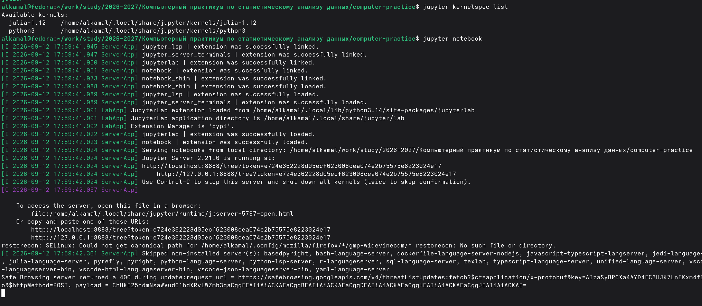{#fig-7 width=70%}

После запуска сервера в браузере открылся интерфейс Jupyter, отображающий содержимое рабочей директории проекта, включая каталоги `labs` и `template` и основные файлы репозитория ([рис. @fig-8]).

{#fig-8 width=70%}

Дополнительно командой `jupyter lab` был запущен JupyterLab. В терминале отображается успешная загрузка компонентов JupyterLab и адрес локального сервера на порту `8888` ([рис. @fig-9]).

{#fig-9 width=70%}

После запуска JupyterLab в окне Launcher доступны различные среды выполнения. Наличие пункта `Julia 1.12` подтверждает возможность создания Notebook и консоли с ядром Julia ([рис. @fig-10]).

{#fig-10 width=70%}

При создании нового Notebook было выбрано ядро `Julia 1.12`, которое используется для выполнения команд Julia непосредственно в ячейках JupyterLab ([рис. @fig-11]).

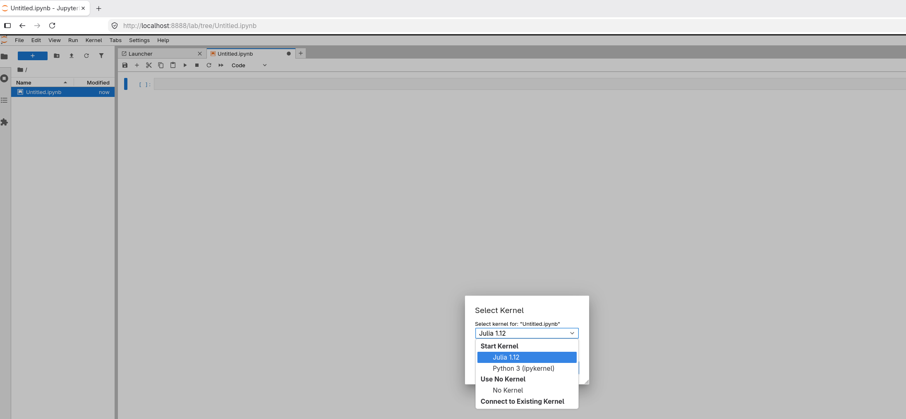{#fig-11 width=70%}

В созданном Notebook были выполнены простейшие арифметические операции и получены их результаты. Также с помощью справочного запроса `?println` была выведена встроенная документация функции `println` ([рис. @fig-12]).

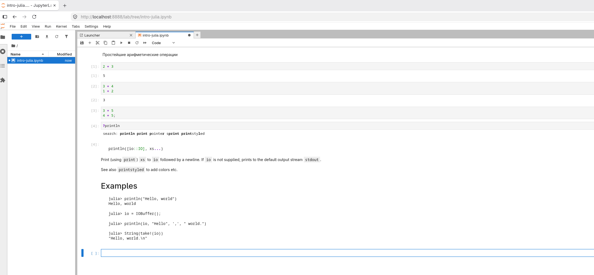{#fig-12 width=70%}

В Notebook были выполнены системные команды `;date` и `;whoami`. В результате выведены текущие дата и время, а также имя пользователя системы ([рис. @fig-13]).

{#fig-13 width=70%}

Далее были рассмотрены основные числовые типы Julia с помощью функции `typeof`. Показаны целые, вещественные, комплексные и иррациональные значения, специальные значения `Inf`, `-Inf`, `NaN`, диапазоны целочисленных типов, а также операции преобразования и продвижения типов ([рис. @fig-14]).

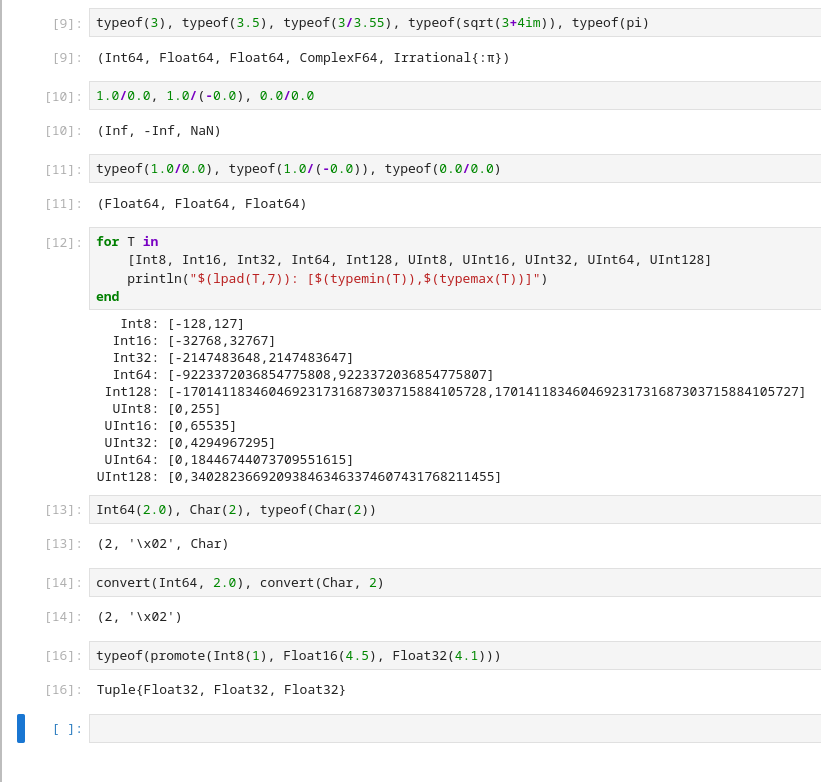{#fig-14 width=70%}

В завершение были рассмотрены два способа определения функций в Julia. Функция `f(x)` задана конструкцией `function ... end`, а функция `g(x)` — краткой записью; при вызове с аргументами `4` и `8` получены результаты `16` и `64` соответственно ([рис. @fig-15]).

{#fig-15 width=70%}

Были рассмотрены способы создания и обработки массивов и матриц в Julia. Выполнено обращение к элементам массива по индексам, сформирована матрица размером `2×2`, а также выполнено матричное выражение, результатом которого стала матрица со значением `27` ([рис. @fig-16]).

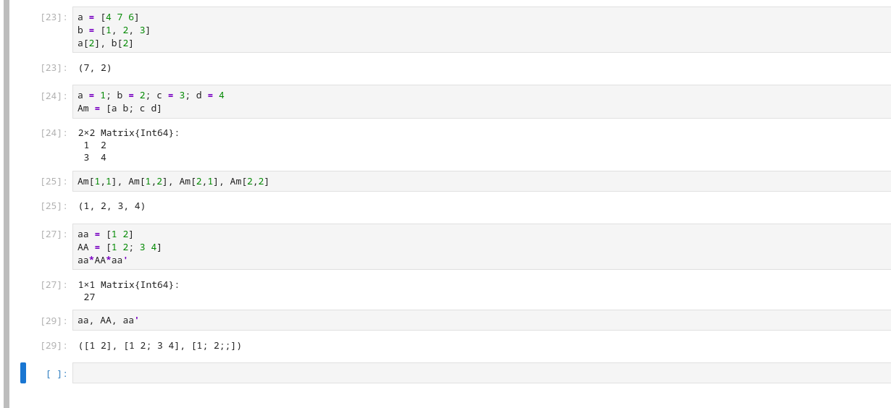{#fig-16 width=70%}

В рамках самостоятельной работы были исследованы функции ввода и вывода данных. На примерах показана работа `print()`, `println()` и `show()`, а функции `write()` и `read()` использованы для записи данных в текстовый файл `example.txt` и последующего чтения его содержимого ([рис. @fig-17]).

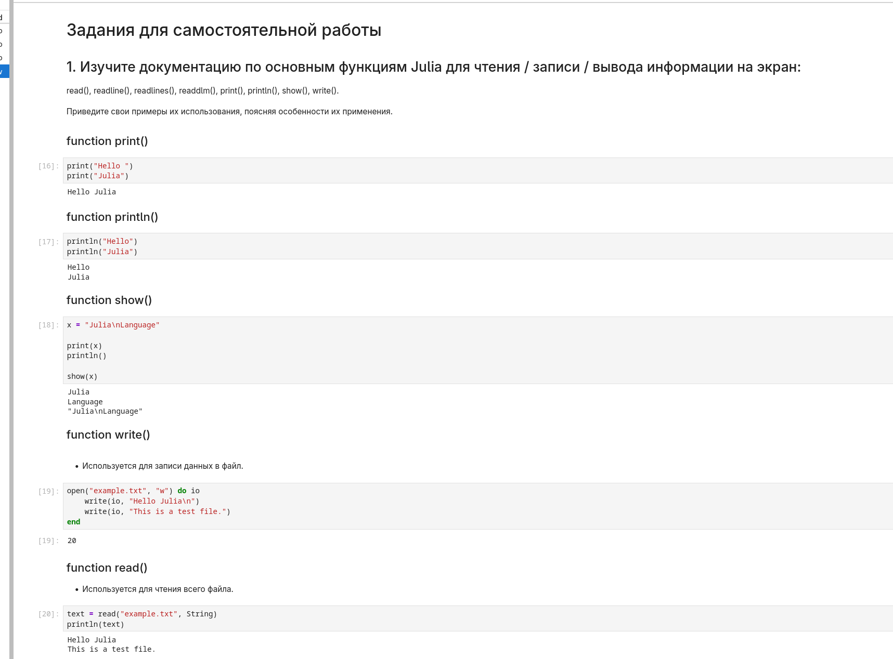{#fig-17 width=70%}

Для чтения данных из файла были также рассмотрены функции `readline()`, `readlines()` и `readdlm()`. Первая считывает одну строку, вторая возвращает строки файла в виде массива, а `readdlm()` была применена для чтения числовых данных из файла `data.txt` в виде матрицы ([рис. @fig-18]).

{#fig-18 width=70%}

Далее была исследована функция `parse()`, используемая для преобразования строковых значений в заданный тип. Выполнено преобразование строки `"123"` в `Int64`, строки `"3.1415"` в `Float64`, а строка `"1010"` с основанием системы счисления `2` преобразована в значение `10` ([рис. @fig-19]).

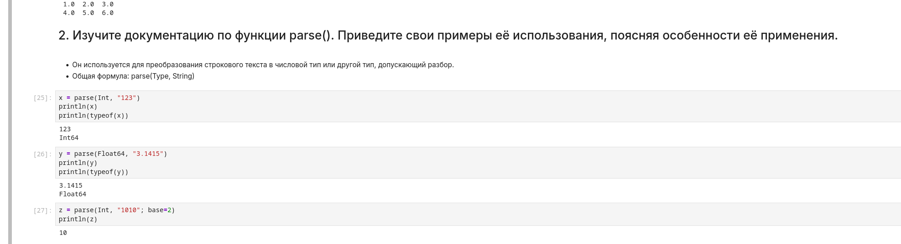{#fig-19 width=70%}

Для изучения базовых математических операций были заданы переменные разных числовых типов. Выполнены сложение, вычитание и умножение целых и вещественных значений, а также обычное деление, целочисленное деление `div()` и вычисление остатка `rem()` ([рис. @fig-20]).

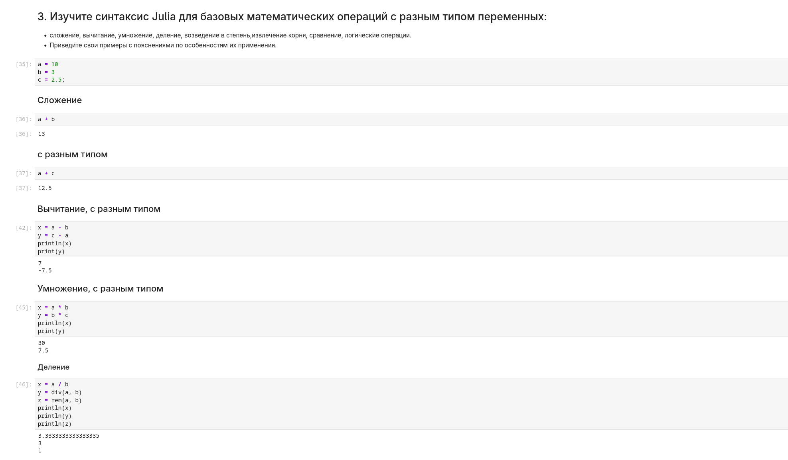{#fig-20 width=70%}

Далее были рассмотрены возведение в степень и извлечение квадратного корня. Также выполнены операции сравнения `>`, `<`, `==`, `!=` и логические операции `&&`, `||`, `!`, возвращающие значения `true` или `false` ([рис. @fig-21]).

{#fig-21 width=70%}

Для работы с векторами были созданы векторы `v1` и `v2`. На их основе выполнены сложение и вычитание, вычислено скалярное произведение с помощью `dot()`, показано транспонирование и умножение вектора на скаляр ([рис. @fig-22]).

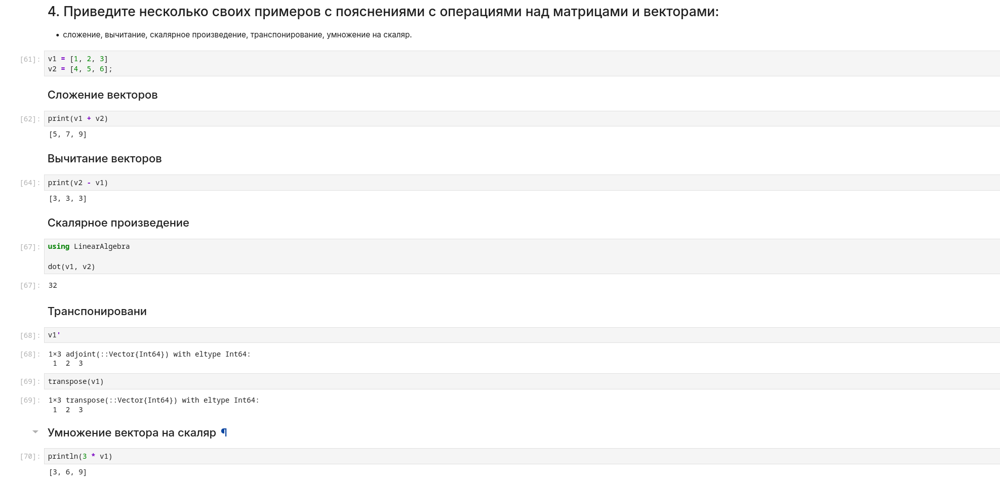{#fig-22 width=70%}

Для исследования операций над матрицами были созданы две матрицы `A` и `B` размером `2×2`. Выполнены их сложение и вычитание, транспонирование матрицы `A`, а также умножение этой матрицы на скаляр `2` ([рис. @fig-23]).

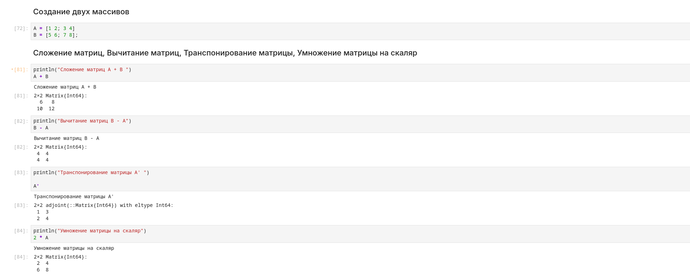{#fig-23 width=70%}





# Заключение

В ходе лабораторной работы была настроена среда для работы с Julia и JupyterLab. Были изучены основные типы данных, функции чтения, записи и вывода информации, функция parse(), арифметические, логические операции и операции сравнения. Также были рассмотрены способы создания функций и выполнены основные операции с векторами и матрицами.

